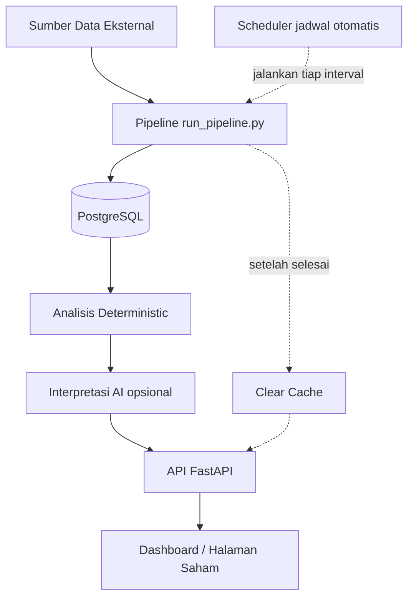
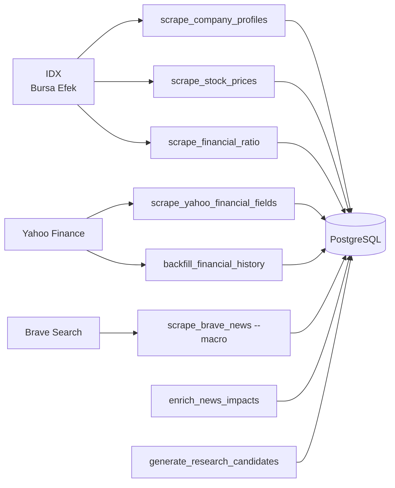
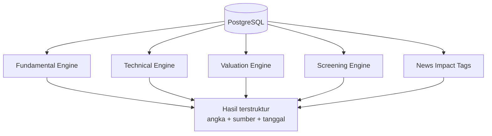
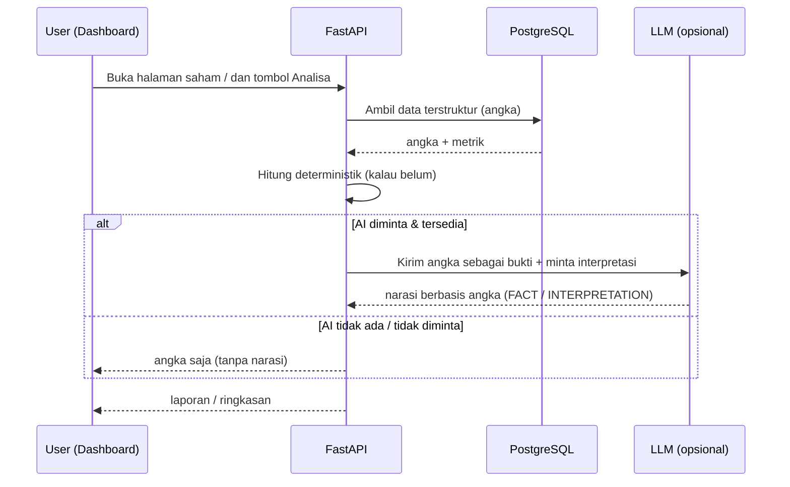
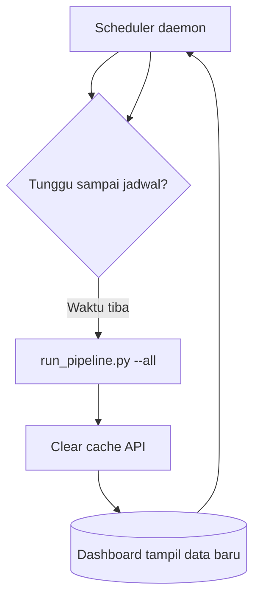
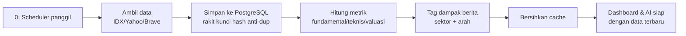

# Alur Data & Analisa Otomatis — IDX-BEI Investment Research Platform

> **Untuk siapa:** kamu (user awam) yang ingin tahu **apa yang terjadi di balik layar**
> ketika aplikasi "otomatis" punya data harga, berita, fundamental, dan analisa AI.
> **Tidak perlu ngoding** untuk membaca dokumen ini.

---

## 0. Ringkasan 30 detik

Aplikasi bekerja dalam 3 tahap yang berulang otomatis:

```
  [1] AMBIL DATA  →  [2] SIMPAN & HITUNG  →  [3] TAMPILKAN & ANALISA
      (dari luar)       (PostgreSQL,      (API + Dashboard + AI)
                          angka tetap)
```

Semuanya **dijalankan oleh scheduler** (jam alarm komputer), jadi kamu **tidak perlu
menjalankan apa pun secara manual**. Kamu cukup buka dashboard dan membaca.

- **Sumber data:** IDX (Bursa Efek Indonesia), Yahoo Finance, Brave Search (berita).
- **Rumah data:** PostgreSQL (basis data).
- **Angka = pasti:** semua metrik (harga, ROE, P/E, dll.) dihitung oleh mesin, **bukan dikarang AI**.
- **AI hanya "menceritakan"** angka yang sudah ada, tidak mengada-ada.

---

## 1. Peta Besar (diagram)



> Kotak `[Sumber Data]` dan `[Scheduler]` adalah hal-hal **di luar** aplikasi yang
> berjalan otomatis. Yang berwarna diam (PostgreSQL) adalah "penyimpanan" semua angka.

---

## 2. Tahap 1 — Ambil Data (dari luar, otomatis)

`run_pipeline.py` menjalankan scraper secara berurutan. Urutan penting agar tabel yang
punya "relasi" (mis. harga milik perusahaan) tidak error.

| Urut | Step `pipeline`       | Data yang diambil                                     | Sumber        |
| ---- | --------------------- | ----------------------------------------------------- | ------------- |
| 1    | `companies`           | Daftar & profil perusahaan (nama, sektor, listing)    | IDX           |
| 2    | `prices`              | Harga harian (OHLCV) — hanya tanggal yang belum ada   | IDX           |
| 3    | `financial_ratio`     | Rasio keuangan terbaru (P/E, ROE, dll.)               | IDX           |
| 4    | `yfinance`            | Bonus dari Yahoo: dividend yield, current ratio, CAGR | Yahoo Finance |
| 5    | `financial_history`   | Riwayat fundamental multi-tahun (grafik)              | Yahoo Finance |
| 6    | `news_brave`          | Berita **makro/ekonomi/politik** (lewat Brave)        | Brave Search  |
| 7    | `news_impacts`        | Tag "berita ini → sektor mana, naik/turun"            | dihitung      |
| 8    | `research_candidates` | Kandidat riset dari dampak berita (rank/baseline)     | dihitung      |
| 9    | `research_analyze`    | Analisa AI menyeluruh untuk kandidat (opsional)       | AI (opsional) |

**Penting soal berita & sumber:**

- Berita **makro** (ekonomi, kebijakan, komoditas) itu bagus untuk **memprediksi dampak** ke sektor/saham.
- Filter `BRAVE_SOURCES` memastikan hanya sumber berita **tepercaya** yang dipakai.
- Setiap berita diberi `news_code = hash(url)` supaya **tidak duplikat** saat dijalankan ulang.
- Berita **per-ticker** tidak dijalankan otomatis di pipeline; diambil **on-demand** saat kamu klik _analisis menyeluruh_ (tergantung kebutuhan terbaru saham itu).



---

## 3. Tahap 2 — Simpan & Hitung (angka yang pasti)

Semua data masuk ke **PostgreSQL**. Kemudian **Analisis Deterministic** menghitung
metrik dengan rumus tetap, bukan tebakan AI:

- **Fundamental:** ROE, ROA, margin, debt-to-equity, CAGR, dll.
- **Teknikal:** SMA/EMA, RSI, MACD, Bollinger, volatilitas, drawdown.
- **Valuasi:** P/E, P/B, EV/EBITDA, dividend yield.
- **Dampak berita:** dari lexicon `news_impacts` → "suku bunga naik" → sektor `Keuangan` naik, `Properti` turun.

> **Aturan emas:** angka = mesin. AI **boleh menafsirkan** angka itu, **tidak boleh mengarang** angka.



---

## 4. Tahap 3 — Tampilkan & Analisa (AI di atas angka)

Setelah angka siap, API FastAPI menyajikannya dan **AI (opsional)** menafsirkannya.



- **`/ai/analyze`** → laporan riset lengkap satu saham.
- **`/ai/screen-analysis`** → hasil screening + interpretasi AI.
- **`/ai/macro-impact`** → dampak berita makro → sektor/saham, di-ranking.
- **Research Memory** → laporan lama disimpan, bisa dibandingkan "apa yang berubah".

> AI **selalu** diberi angka sebagai bukti. Kalau `OPENAI_API_KEY` belum diisi,
> aplikasi tetap jalan dan menampilkan angka — hanya narasi AI yang kosong.

---

## 5. Scheduler — bagaimana "otomatis" bekerja

`run_pipeline.py` **tidak berjalan sendiri**. Ada **`scheduler.py`** yang seperti
**jam alarm**: ia menunggu, lalu menjalankan pipeline penuh, lalu membersihkan cache
agar dashboard langsung menampilkan data baru.



### Pengaturan jadwal (lewat `.env`)

| Variabel                                     | Default        | Arti                                               |
| -------------------------------------------- | -------------- | -------------------------------------------------- |
| `SCRAPE_SCHEDULE_TIME`                       | (kosong)       | Jam harian `HH:MM` (Asia/Jakarta), mis. `18:00`    |
| `SCRAPE_INTERVAL_HOURS`                      | `24`           | Tiap berapa jam (dipakai bila waktu harian kosong) |
| `SCRAPE_TIMEZONE`                            | `Asia/Jakarta` | Zona waktu                                         |
| `AUTO_ANALYZE_ENABLED`                       | `false`        | Aktifkan auto AI analysis setelah pipeline         |
| `AUTO_ANALYZE_MIN_HOURS`                     | `24`           | Minimum jam antar analisis per ticker (guard)      |
| `AUTO_ANALYZE_TICKERS`                       | (kosong)       | Override daftar ticker (default: favorites)        |
| `RESEARCH_CANDIDATES_USE_LLM`                | `false`        | Generate kandidat riset + LLM interpretasi makro   |
| `RESEARCH_CANDIDATES_MIN_HOURS`              | `48`           | Lookback window kandidat (jam)                     |
| `RESEARCH_CANDIDATES_TOP_SECTORS`            | `10`           | Top sektor yang dipertimbangkan                    |
| `RESEARCH_CANDIDATES_MIN_NET`                | `0.25`         | Minimum \|net_strength\| agar jadi kandidat        |
| `RESEARCH_CANDIDATES_MAX_TICKERS_PER_SECTOR` | `5`            | Emiten paling likuid per sektor (P1 expansion)     |
| `RESEARCH_CANDIDATES_BASELINE_DAYS`          | `30`           | Window baseline historis net_strength (P4)         |
| `RESEARCH_CANDIDATES_MIN_SAMPLE_DAYS`        | `5`            | Min hari agar baseline dianggap reliable (P4)      |

**Contoh:**

```bash
uv run python scheduler.py              # tiap 24 jam sesuai env
uv run python scheduler.py --interval 6 # tiap 6 jam
uv run python scheduler.py --dry-run    # lihat jadwal berikutnya
uv run python scheduler.py --now        # jalankan sekali sekarang
```

---

## 6. Ringkasan "Siklus Hidup" per jadwal



---

## 7. Tabel singkat "Siapa yang lihat apa"

| Kamu di dashboard                    | Datang dari mana                      | Perlu AI?                           |
| ------------------------------------ | ------------------------------------- | ----------------------------------- |
| Harga & grafik candlestick           | `stock_prices` (+ indikator dihitung) | Tidak                               |
| Profil & key stats                   | `companies` + `financial_ratios`      | Tidak                               |
| Tab Fundamental / Teknikal / Valuasi | mesin analisis                        | Tidak                               |
| Feed berita per saham & event        | `news_articles` + classifier event    | Tidak                               |
| Dampak makro (sektor naik/turun)     | `news_impacts`                        | Tidak _(angka)_, bisa AI _(narasi)_ |
| Laporan riset AI                     | `research_memory` + LLM               | Ya (opsional)                       |

---

## 8. Kenapa desainnya begitu?

| Pertanyaan                               | Jawaban                                                        |
| ---------------------------------------- | -------------------------------------------------------------- |
| Kenapa tidak langsung AI-generate semua? | Angka harus **bisa dilacak & diulang**; AI bisa salah/ngarang. |
| Kenapa pakai PostgreSQL bukan file?      | Satu sumber kebenaran, bisa disaring, tahan banyak data.       |
| Kenapa scheduler bukan manual?           | Data berubah tiap hari; otomatis = selalu segar tanpa effort.  |
| Kenapa ada `clear_cache`?                | Supaya dashboard tidak menyajikan data basi setelah scrape.    |
| Kenapa filter sumber berita?             | Hindari berita tidak tepercaya masuk.                          |

> **Prinsip utama:** _Data dan angka dulu, AI di atasnya_. Kamu yang akhirnya memutuskan,
> aplikasi hanya menyediakan bukti.
